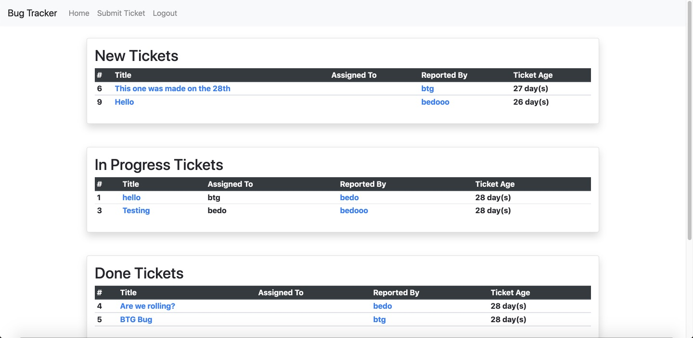
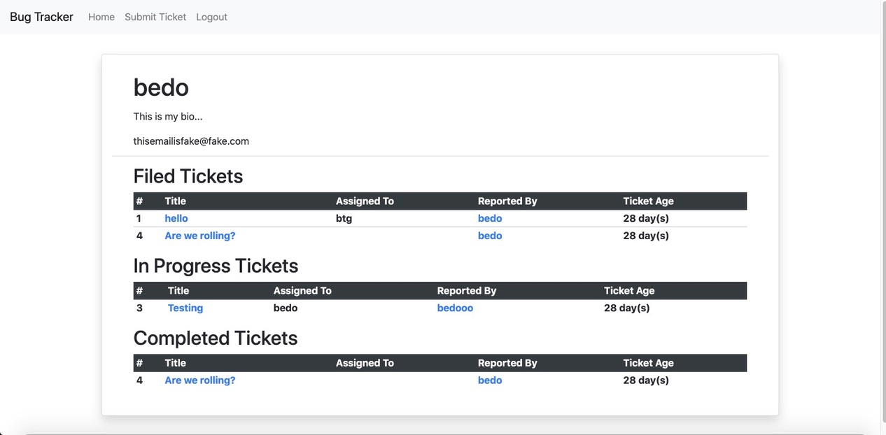
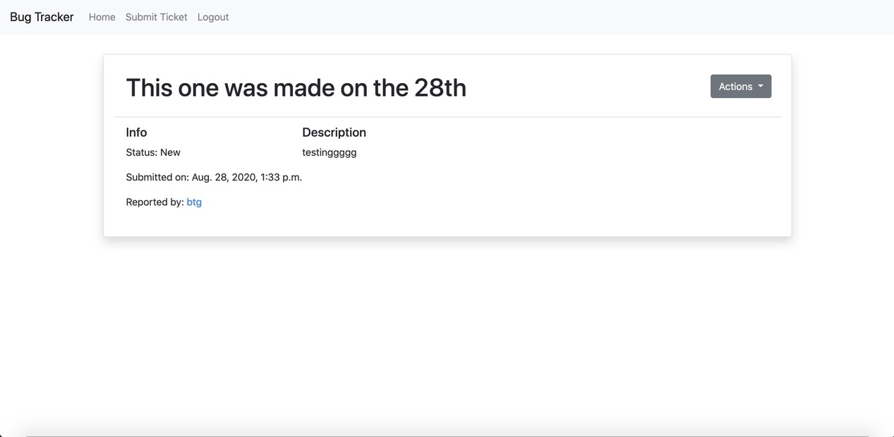
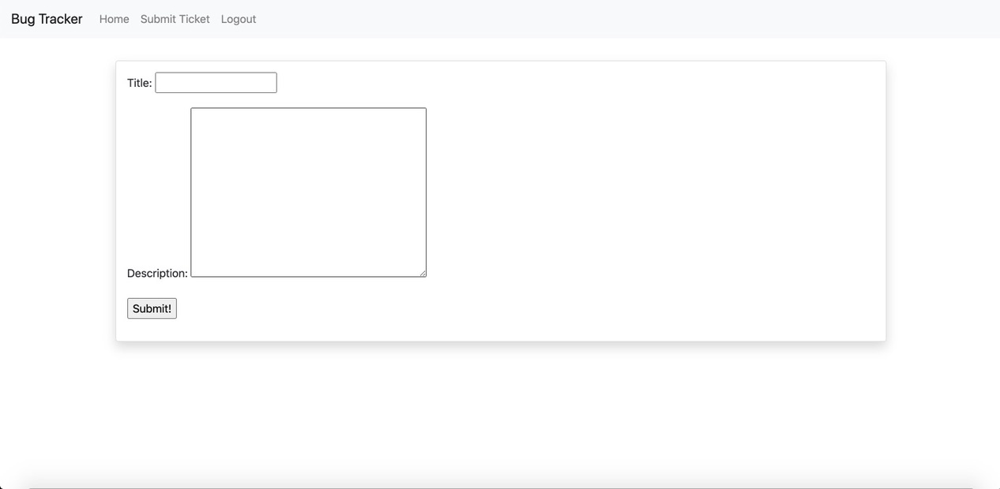

# Bug Tracker

A program to track bugs.

## Discription

**Users must login to access the app, users cannot signup on their own, they must be signed up by a superuser (to prevent bugs being created by just anyone).** Users can submit tickets that track bugs. They are then filtered into three catagories. New Tickets, In Progress Tickets, and Done Tickets. Each ticket has an id, title, description, user assigned to, reported by, and ticket age. You can view all the tickets on the home page or view an individual ticket by clicking on the title of the desired ticket. Viewing a users page can also be done by clicking on the user's name, which takes you to their page where you can see the tickets they've filed, are working on, or completed.

**Homepage**\

**User Detail Page**\

**Ticket Detail Page**\

**Form**\

